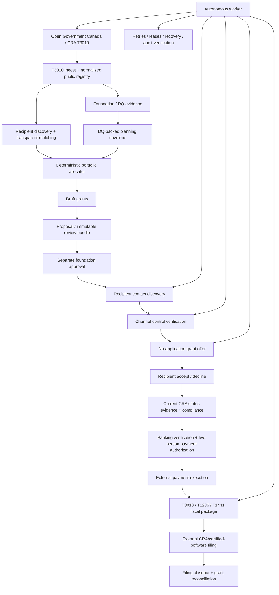

# Canadian Philanthropy Clearing House

A production-oriented **ChatGPT App / MCP backend and recipient self-service clearing layer** for routing Canadian foundation disbursement capacity toward registered charities and other eligible recipients with less application overhead, stronger auditability, and explicit human control over consequential decisions.

The system combines public **CRA T3010 / List of charities** data from Open Government Canada with deterministic allocation logic, authenticated grant workflows, an autonomous operations worker, verified recipient contact delivery, a no-account recipient offer portal, compliance/payment gates, and CRA reporting-package reconciliation.

> **Core design rule:** automate discovery, matching, drafting, verification delivery, retries, reconciliation, and paperwork; do **not** automate fiduciary approval, legal/compliance judgment, or bank transfers.

## What this project is

The clearing house reverses the usual grant-application flow.

Instead of:

```text
charity searches for funder
  → interprets eligibility
  → writes application
  → uploads duplicate documents
  → waits
  → repeats for another funder
```

this system supports:

```text
foundation has allocable capital / DQ planning need
  → clearing house discovers candidate recipients
  → deterministic matching + portfolio construction
  → foundation review / approval
  → verified recipient contact
  → no-application offer
  → recipient accepts or declines
  → compliance + current-status checks
  → external payment authorization/execution
  → T3010 / T1441 reporting package
  → filing reconciliation + audit trail
```

It also supports a recipient-first path when a foundation still requires an application:

```text
recipient-approved organization profile + funding request
  → transparent foundation screening from T3010/historical evidence
  → grounded foundation-specific package + missing-fact checklist
  → recipient confirms the unchanged package is ready
  → recipient files through the foundation's external channel
  → clearing house records the external reference and outcome
```

The two paths share evidence and controls. Historical support is a screening signal—not a current grant budget—and every recipient remains responsible for verifying current guidelines, eligibility, geography, deadlines, agreements and reporting requirements.

A recipient does **not** need a ChatGPT account to verify a contact channel or respond to a grant offer.

## What it is not

This repository is not:

- a replacement for a foundation board or authorized grant approver;
- a live CRA legal-status API;
- a legal opinion on whether a disbursement qualifies under the Income Tax Act;
- an autonomous banking system;
- a mechanism for ChatGPT to decide who is legally entitled to receive funds;
- a claim that CRA accepted a filing merely because a reporting package was prepared.

Public filing data is used for discovery, evidence and planning. Consequential workflow transitions remain permissioned and auditable.

---

## System architecture



### Runtime processes

The production topology is intentionally split:

```text
PostgreSQL
   │
   ├── migrations
   │      └── schema readiness gate
   │
   ├── MCP API server
   │      └── public read tools + authenticated workflow tools
   │
   ├── autonomous worker
   │      └── schedules, leases, retries, data refresh, offer plumbing
   │
   └── recipient portal
          └── contact verification + offer accept/decline
```

The API, worker and portal share PostgreSQL but have different responsibilities. Migrations and schema readiness complete before application processes are considered ready.

---

## Current capabilities

### 1. Open Canada / CRA T3010 ingestion

The importer discovers the current public resources from Open Government Canada's CKAN catalogue rather than depending on fixed CSV filenames.

It can ingest and normalize:

- charity identification;
- general information;
- financial data;
- charitable programs;
- qualified donees;
- non-qualified donees;
- Schedule 1 foundation information;
- Schedule 8 disbursement-quota information;
- charity web addresses.

Source rows retain the original CRA fields alongside normalized metadata such as BN, source resource, source row and dataset vintage.

The autonomous worker can refresh the public data on a configured schedule with `ENABLE_T3010_SYNC=1` and reload the dataset used by the MCP server.

### 2. Foundation DQ and capital planning

The project supports both:

- statutory-style tiered DQ calculations when the required property basis is supplied; and
- explicitly labelled scenario models such as a flat 5% payout assumption.

Schedule 8 evidence is parsed deterministically and tied to source vintage. Stale filing data is not silently projected into a later planning period as though it were current.

A DQ-backed envelope can reconcile:

```text
planning requirement
- already paid grants
- active grant pipeline
- existing policy reservations
- other expected qualifying spending
= unreserved planning envelope
```

The resulting snapshot is hash-bound so a later policy cannot silently rely on materially changed evidence.

### 3. Transparent recipient matching and portfolio construction

Matching is evidence-based and explainable rather than an opaque “worthiness score.” Inputs can include foundation filing text, program descriptions, geography, historical donees, public recipient descriptions and explicit foundation constraints.

The allocator:

- uses integer-cent money arithmetic;
- rejects sub-cent values;
- enforces budget ceilings;
- enforces minimum/maximum grant amounts;
- enforces recipient-count limits;
- supports focus/geography constraints;
- reports unallocated capital rather than inventing recipients;
- does not allocate to zero-evidence candidates;
- produces a SHA-256 plan-integrity hash.

The plan hash proves that the supplied plan has not changed. It is **not** evidence that the foundation approved it.

Materializing a portfolio creates **draft grants only**.

### 4. Recipient-first application workspace

Verified recipient administrators can store a reusable, versioned funding profile and describe a project or operating request once. This works for registered charities and for non-qualified/non-lucrative ventures after an administrator independently verifies the venture claim.

ChatGPT can then:

- rank foundations using transparent overlap with recipient-approved facts and filing-derived evidence;
- show the shared evidence terms, source vintage and support signal when it is published;
- prepare a deterministic foundation-specific package;
- return exact missing-information findings instead of inventing facts;
- hash-bind the organization, request, target foundation, sources and readiness findings;
- record an external submission reference and recipient-reported outcome.

The lifecycle is:

```text
draft → ready → submitted → awarded | declined | withdrawn
```

`ready` requires an unchanged package hash and exact recipient confirmation. `submitted` requires a channel, external reference and timestamp. An `awarded` outcome records what the recipient reports; it does not create a foundation-side grant, approve payment or prove that funds moved.

Profiles and applications are private organization-scoped workflow data. Updating a profile or request never rewrites an existing application snapshot; prepare a new draft when source facts change.

### 5. Autonomous allocation policies

A foundation can establish a bounded fiscal/annual allocation policy once. The worker can then keep the approved planning envelope populated with drafts, avoid duplicate recipients, and replace declined recipients when capacity reopens.

Optional auto-proposal can move policy-created drafts into proposal state and assemble them into immutable review bundles. A crash-recovery worker can reconstruct missing bundles from already-proposed grants.

The worker cannot approve its own proposals.

### 6. Batch review with separation of duties

A foundation analyst can prepare a hash-bound review bundle containing multiple proposed grants. A **different authorized foundation approver** can approve the immutable bundle in one action.

This collapses dozens of repetitive approvals into one review without removing the proposer/approver separation-of-duties control.

Bundle approval does not imply recipient acceptance, compliance approval or payment authorization.

### 7. Verified recipient contact discovery

Public contact information is treated only as **candidate evidence**.

Potential contact sources include:

- public T3010/Open Canada phone/email fields when available;
- the T3010 charity web-address resource;
- bounded public website discovery.

Website discovery is constrained by:

- public-network-only destination checks;
- DNS/IP validation designed to prevent SSRF and DNS rebinding into private networks;
- same-site crawl/redirect restrictions;
- robots rules;
- page-count, byte and timeout limits;
- phone fax suppression;
- contact-specific retry backoff.

Discovered phone numbers and email addresses are normalized, fingerprinted and encrypted at rest. Discovery never marks a destination verified.

### 8. Email, SMS and voice verification/delivery

Supported recipient channels are:

- `email`;
- `sms`;
- `voice`.

The verification lifecycle is:

```text
public contact candidate
  → encrypted candidate record
  → one-time verification challenge
  → verification message sent to that exact channel
  → recipient proves control
  → contact becomes verified
  → verified channel becomes eligible for grant delivery
```

A public or scraped email address cannot receive a grant offer until the recipient proves control of that address.

Offer routing is provider-aware. A preferred channel is attempted first, but a configured verified alternative may be used when appropriate. An unconfigured provider is never treated as an available delivery path.

#### Email

Production email can use Resend:

```bash
EMAIL_PROVIDER=resend
RESEND_API_KEY=...
RESEND_FROM_EMAIL=grants@your-verified-domain.ca
```

The adapter uses authenticated HTTPS requests and provider idempotency keys. The sender/domain must be verified with the email provider.

#### SMS / voice

Production phone delivery can use Twilio:

```bash
NOTIFICATION_PROVIDER=twilio
TWILIO_ACCOUNT_SID=...
TWILIO_AUTH_TOKEN=...
TWILIO_FROM_NUMBER=...
```

For development, both email and phone providers can use `console`; both can also be disabled independently.

### 9. No-account recipient portal

With `RECIPIENT_PORTAL_ENABLED=1`, recipients can interact without a clearing-house login or ChatGPT account.

The portal handles two separate capability flows:

#### Contact verification

The recipient opens a one-time capability URL sent to the candidate channel and confirms control of that channel. This action does **not** accept a grant.

#### Grant offer response

Once a grant is approved and a verified contact exists:

1. the worker creates/reuses a single-use offer capability immediately before delivery;
2. the recipient receives a message stating that no grant application is required;
3. the recipient reviews amount, purpose and versioned terms;
4. the recipient explicitly chooses **Accept** or **Decline**;
5. the decision is written atomically to consent, grant state, grant events and the HMAC audit chain;
6. the capability is consumed and cannot be reused.

The portal sends defensive headers including `Cache-Control: no-store`, `Referrer-Policy: no-referrer`, CSP, frame restrictions and content-type protections. Terms are rendered as escaped text rather than trusted HTML.

### 10. Current charity-status evidence

Annual T3010 data is not treated as a release-time legal-status guarantee.

The worker can prepare status-verification tasks and collect official public evidence such as revocation indicators. Absence from a revocation source is **not** treated as proof that a charity is currently eligible.

Before payment authorization, an authorized reviewer records a current observation from CRA's List of charities. The payment gate requires sufficiently fresh authoritative status evidence.

The repository deliberately does not scrape an undocumented CRA application endpoint and present the result as an authoritative API determination.

### 11. NQD diligence and compliance

Non-qualified-donee grants have a separate proportional diligence workflow. Preparation and approval are separated, and compliance approval remains an explicit authorized action.

The reporting classifier aggregates NQD grants by grantee over the fiscal period and routes reporting based on the configured/current CRA rules represented by the implementation.

This software is compliance support, not legal advice; operators remain responsible for validating current CRA requirements before production filing.

### 12. Banking verification and payment boundary

Banking evidence is represented only by encrypted external verification references. Raw bank-account/card coordinates are not part of the baseline application data model.

The payment workflow requires:

```text
recipient accepted terms
+ fresh authoritative status evidence
+ compliance approval
+ external banking verification
+ payment intent created by operator A
+ authorization by different operator B
= manual/external payment authorization
```

**There is no autonomous bank-transfer adapter in the baseline implementation.**

The application can record that an externally executed payment occurred and store its external reference. It does not send the money itself.

### 13. Fiscal reporting packages and closeout

Paid grants can be reconciled into deterministic fiscal-period reporting packages containing the grant-ledger facts needed for T3010-related review, including qualified-donee and NQD routing.

The package builder supports T1236/T1441-oriented exports and only calls a package filing-ready when required metadata is present.

Reporting closeout is intentionally separate from package preparation:

```text
prepare frozen fiscal package
  → foundation files through CRA / certified software
  → operator supplies external submission reference
  → clearing house revalidates package hash + payment ledger
  → one SERIALIZABLE transaction closes every grant in that package
  → out-of-period grants remain untouched
```

The application never invents an external CRA filing reference and never claims CRA accepted or validated the filing.

### 14. Autonomous operations and recovery

The autonomous worker uses PostgreSQL-backed schedules, leases and heartbeats so multiple replicas can compete safely.

It handles operational plumbing such as:

- scheduled T3010 refresh;
- dataset reload;
- allocation-policy cycles;
- review-bundle recovery;
- recipient contact discovery;
- notification dispatch/retry;
- secure contact/offer link issuance;
- pending offer-batch progression;
- stale notification-lock recovery;
- expired capability retirement;
- worker-heartbeat cleanup;
- status-verification task refresh;
- audit-chain verification.

Long-running jobs renew leases. Stale leases can be recovered by another worker rather than permanently stranding work.

The worker does **not** silently approve grants, approve NQD diligence, manufacture authoritative charity status, authorize both sides of a payment, execute bank transfers, or claim a CRA filing was submitted.

### 15. Operational status

Authorized operators can query an organization-scoped operational status surface to see where attention is required, including areas such as:

- T3010/data freshness;
- worker health;
- allocation policies;
- review bundles awaiting approval;
- contact verification;
- offer batches and recipient responses;
- CRA-status verification queues;
- compliance queues;
- payment queues;
- reporting/filing state.

The status surface is read-only decision support; it does not perform the consequential actions it reports.

---

## ChatGPT App / MCP integration

This repository implements a remote **Model Context Protocol (MCP) server** that can be configured as a custom app in ChatGPT. It does **not** use the legacy `ai-plugin.json` ChatGPT Plugins model.

OpenAI's current Apps guidance uses MCP for custom apps and recommends the Apps SDK when a richer in-ChatGPT app/UI experience is required. This repository currently provides the MCP backend plus its own recipient web portal; an Apps SDK widget can be added later without changing the core clearing-house workflow.

Typical ChatGPT setup is:

1. deploy this MCP server to a reachable HTTPS endpoint;
2. configure OIDC/OAuth if authenticated workflow tools are enabled;
3. enable the applicable ChatGPT developer/custom-app workflow for your workspace/account;
4. create a custom app using the remote MCP endpoint;
5. scan the server tools;
6. complete OAuth authorization;
7. test read and write actions and review confirmation/permission behavior;
8. publish or approve the app according to the applicable ChatGPT workspace/app process.

OpenAI product availability and publishing controls evolve; consult the current official OpenAI Apps/MCP documentation when deploying.

When OAuth is used, configure refresh-token support. For OIDC providers this normally means advertising/supporting `offline_access`; otherwise long-lived ChatGPT connectivity can require reauthentication.

Protected-resource metadata is published at:

```text
/.well-known/oauth-protected-resource
```

Primary MCP endpoint:

```text
/mcp
```

---

## MCP tool surface

The exact tool registry is the source of truth and can be inspected with MCP `tools/list`.

### Public/read-oriented capabilities

Representative tools include:

- dataset status and Open Canada catalogue inspection;
- generic search/fetch;
- charity and foundation search;
- foundation DQ evidence lookup;
- foundation-recipient matching;
- DQ and capital scenario calculations;
- administrative-capacity modelling.

`sync_t3010` is optional and not exposed by default unless synchronization writes are explicitly enabled.

### Authenticated workflow capabilities

Authenticated mode adds permission-scoped tools covering:

- identity / role inspection;
- organization claims and verified role grants;
- recipient funding profiles and reusable funding requests;
- recipient-to-foundation screening and hash-bound application packages;
- recipient-controlled application readiness, external submission evidence and outcomes;
- grant creation, proposal and approval;
- portfolio planning and draft materialization;
- autonomous allocation-policy configuration;
- DQ envelope suggestion;
- review-bundle creation/approval;
- recipient offer batches;
- current CRA-status evidence and reviewer observations;
- NQD diligence and compliance review;
- banking-verification evidence;
- manual payment intent/authorization/recording;
- fiscal reporting metadata, package export and filing closeout;
- operational status.

Tool annotations distinguish read-only, write and consequential actions. Authorization is enforced server-side; tool descriptions are not the security boundary.

---

## Quick start

Requirements:

- Node.js 22+
- PostgreSQL 16 for persistent/authenticated workflow mode

Install and run the public/read-only app locally:

```bash
npm install
npm test
npm run readiness
npm run ingest:t3010 -- --year 2024
npm start
```

Local MCP endpoint:

```text
http://localhost:3000/mcp
```

Run one autonomous-worker cycle:

```bash
npm run ops:once
```

Run the continuous worker:

```bash
npm run ops:worker
```

---

## Database and migrations

Apply every migration in lexical order:

```bash
for migration in db/migrations/*.sql; do
  psql "$DATABASE_URL" -v ON_ERROR_STOP=1 -f "$migration"
done
```

Then verify the runtime schema contract:

```bash
npm run schema:check
```

Current migrations extend through `015_recipient_funding_workspace.sql` and cover core persistence, authenticated workflow, NQD/payment controls, autonomous scheduling, recipient capabilities, allocation policies, DQ envelopes, review bundles, contact verification, website discovery state, recipient funding applications, reporting packages, fiscal closeout and verified email delivery.

Production API/worker/portal processes should not start against a partially migrated database.

---

## Docker Compose

The supplied Compose topology runs:

```text
postgres
  → migrate
  → schema-check
  → app
  → worker
  → optional recipient-portal profile
```

Start the core stack:

```bash
docker compose up -d
```

Start the recipient portal profile as well:

```bash
docker compose --profile recipient-portal up -d
```

The application image is validated in CI to run as a non-root UID.

---

## Configuration

Start from `.env.example`.

### Core runtime

| Variable | Purpose |
|---|---|
| `NODE_ENV` | `development` or production runtime mode |
| `PORT` | MCP/API HTTP port |
| `PUBLIC_BASE_URL` | Public HTTPS base URL in production |
| `DATABASE_URL` | PostgreSQL connection string |
| `ENABLE_WORKFLOW_WRITES` | Enables authenticated workflow mutations |

### T3010 / public data

| Variable | Purpose |
|---|---|
| `T3010_YEAR` | Dataset year used for local storage/ingestion |
| `T3010_DATA_DIR` | Local T3010 data directory |
| `ENABLE_T3010_SYNC` | Enables scheduled Open Canada refresh |
| `T3010_SYNC_INTERVAL_HOURS` | Refresh cadence |
| `T3010_AUTO_RELOAD_SECONDS` | Server-side reload poll interval |

### Autonomous operations

| Variable | Purpose |
|---|---|
| `AUTOMATION_ENABLED` | Enables worker scheduling |
| `AUTOMATION_POLL_SECONDS` | Scheduler poll cadence |
| `AUTOMATION_LEASE_SECONDS` | Durable job-lease duration |
| `AUTOMATED_PORTFOLIOS_ENABLED` | Enables bounded autonomous portfolio cycles |
| `ALLOCATION_POLICY_POLL_SECONDS` | Allocation-policy cadence |
| `ALLOCATION_POLICY_BATCH_SIZE` | Maximum policies processed per cycle |

### Recipient portal

| Variable | Purpose |
|---|---|
| `RECIPIENT_PORTAL_ENABLED` | Enables no-account contact/offer capabilities |
| `RECIPIENT_PORTAL_BASE_URL` | Public HTTPS portal URL in production |
| `RECIPIENT_PORTAL_PORT` | Portal HTTP port |
| `OFFER_TOKEN_TTL_HOURS` | Capability lifetime; bounded by application rules |

### Website contact enrichment

| Variable | Purpose |
|---|---|
| `WEBSITE_CONTACT_ENRICHMENT_ENABLED` | Enables bounded public website fallback |
| `WEBSITE_CONTACT_TIMEOUT_MS` | Per-request timeout |
| `WEBSITE_CONTACT_MAX_PAGES` | Crawl page cap |
| `WEBSITE_CONTACT_MAX_BYTES` | Response-size cap |

### Authentication and secrets

| Variable | Purpose |
|---|---|
| `OIDC_ISSUER` | OIDC issuer |
| `OIDC_CLIENT_ID` | OIDC client identifier |
| `OIDC_AUDIENCE` | MCP API audience |
| `ENCRYPTION_KEY` | Application encryption key for private destinations/evidence |
| `AUDIT_HMAC_KEY` | HMAC key for chained audit integrity |

Production secrets belong in a real secret manager, not source control.

### Phone notifications

| Variable | Purpose |
|---|---|
| `NOTIFICATION_PROVIDER` | `disabled`, `console` or `twilio` |
| `TWILIO_ACCOUNT_SID` | Twilio account identifier |
| `TWILIO_AUTH_TOKEN` | Twilio credential |
| `TWILIO_FROM_NUMBER` | Verified/supported sender number |

### Email notifications

| Variable | Purpose |
|---|---|
| `EMAIL_PROVIDER` | `disabled`, `console` or `resend` |
| `RESEND_API_KEY` | Resend API credential |
| `RESEND_FROM_EMAIL` | Provider-verified sender identity |

### Payment and controls

| Variable | Purpose |
|---|---|
| `PAYMENT_PROVIDER` | Baseline is `disabled` or manual/external recording |
| `CRA_STATUS_MAX_AGE_HOURS` | Maximum age for authoritative release-status evidence |
| `REQUIRE_SEPARATION_OF_DUTIES` | Enforces proposer/approver and payment-operator separation |
| `RETENTION_DAYS` | Retention-policy input |

Run the fail-closed configuration assessment with:

```bash
npm run readiness
```

---

## Production bootstrap

The first global administrator is created through an explicit operator bootstrap, not through an AI tool.

```bash
DATABASE_URL=postgres://... \
BOOTSTRAP_ADMIN_SUBJECT='<exact OIDC sub>' \
BOOTSTRAP_ADMIN_EMAIL='admin@example.ca' \
npm run bootstrap:admin
```

Production also requires the confirmation value expected by the bootstrap script.

After bootstrap, organization claims and role assignment can be handled through authenticated, organization-scoped workflow tools.

---

## Security model

### Organization-scoped RBAC

Foundation, recipient, compliance, payment and audit roles are scoped to organizations. A role at Foundation A does not authorize access at Foundation B.

### Separation of duties

The system enforces independent actors where required, including:

- proposal vs. grant approval;
- NQD diligence preparation vs. diligence approval;
- payment-intent creation vs. payment authorization.

### Encryption and destination privacy

Phone numbers, email addresses, reusable capability secrets and external banking-verification references are protected with application-layer encryption where designed. Public contact candidates are not exposed as trusted destinations.

### Capability links

Recipient contact and offer links use random bearer secrets. Lookup hashes are stored separately from encrypted reusable material where needed. Links expire and are single-use/consumed according to their workflow.

### Audit integrity

Audit rows are HMAC chained. A streaming verifier can recompute the chain and identify a tampered sequence.

Run manually with:

```bash
npm run audit:verify
```

The autonomous worker can also run integrity verification as an operational job.

### Prompt-injection boundary

Retrieved public text is data, not authority. Public T3010 or website content cannot grant roles, approve grants, change payment state, override policy constraints or satisfy legal/compliance gates by instruction text.

---

## Grant state model

The principal grant lifecycle is:

```text
draft
  → proposed
  → approved
  → offered
  → accepted
  → payment_authorized
  → paid
  → reported
```

Decline is terminal for the offered grant. Other compliance/payment records provide additional gates around state transitions.

Important distinctions:

- **draft** is not an award;
- **approved** is not recipient acceptance;
- **accepted** is not payment authorization;
- **payment_authorized** does not mean this application moved money;
- **reported** requires an external filing/submission reference where applicable and does not imply CRA acceptance.

---

## Testing and protected-main guarantees

`main` is protected and the repository's required checks are intended to prevent untested workflow changes from landing.

The CI suite covers, among other things:

- syntax and unit tests;
- dependency installation/audit;
- Docker Compose validation;
- production container build;
- non-root container execution;
- fail-closed readiness checks;
- all PostgreSQL migrations;
- schema-readiness verification;
- full authenticated grant lifecycle;
- no-account recipient offer lifecycle;
- autonomous allocation-policy behavior;
- DQ-backed envelopes;
- immutable batch review and separation of duties;
- autonomous worker leases/recovery;
- operational-status organization isolation;
- audit-chain tamper detection;
- status-verification evidence workflow;
- fiscal reporting package reconciliation;
- fiscal filing closeout;
- verified SMS/voice contact flow;
- verified email contact flow;
- public and authenticated MCP protocol behavior.

Live workflows also exercise current Open Canada/T3010 ingestion and public-contact source coverage. External-source smoke failures should be investigated, while repository protection is designed so core application correctness does not depend solely on the uptime of an external government service.

Useful commands:

```bash
npm run check
npm test
npm run test:db
npm run test:portal-db
npm run test:allocation-policy-db
npm run test:dq-envelope-db
npm run test:review-bundle-db
npm run test:verified-email-db
npm run schema:check
npm run audit:verify
npm run smoke:t3010
npm run smoke:dq-live
```

---

## Production readiness checklist

Before enabling real foundation workflows, verify all of the following:

- PostgreSQL is durable, backed up and monitored;
- all migrations apply successfully and `npm run schema:check` passes;
- public API and recipient portal use HTTPS;
- OIDC/OAuth is configured with durable refresh-token support where needed;
- organization roles and administrator bootstrap are reviewed;
- `ENCRYPTION_KEY` and `AUDIT_HMAC_KEY` are stored in a secret manager;
- recipient portal is publicly reachable at the configured base URL;
- at least one notification provider is configured for the channels you intend to use;
- Twilio sender configuration is valid if SMS/voice is enabled;
- Resend sender/domain is verified if email is enabled;
- website enrichment remains bounded and public-network-only;
- current CRA-status review procedures are documented for payment release;
- NQD diligence/compliance procedures are reviewed by qualified personnel;
- external banking verification and payment operating procedures are defined;
- no autonomous bank-transfer credentials are introduced without a separate security/legal design review;
- CRA filing remains external and external submission references are reconciled back into the clearing house;
- backups, recovery, worker-health and audit-verification runbooks have been tested;
- protected `main` required checks remain enabled.

---

## Known external dependencies / remaining operator responsibilities

The application code cannot supply these on its own:

- production hosting and DNS/TLS;
- PostgreSQL service and backups;
- OIDC/OAuth identity provider;
- secret-management/KMS infrastructure;
- Twilio account/number if SMS or voice is used;
- Resend account and verified sending domain if email is used;
- foundation identity and role verification;
- authoritative human/current CRA status observation before payment release;
- qualified legal/compliance review for NQD workflows;
- external banking verification;
- bank/payment execution;
- final submission through each foundation's external application channel;
- final CRA/certified-software filing.

Those are deliberate institutional boundaries, not unfinished placeholders to be silently automated.

---

## Repository guide

Key documentation:

- `docs/WORKFLOW.md` — grant workflow and state transitions;
- `docs/PRODUCTION_REQUIREMENTS.md` — production control requirements;
- `docs/THREAT_MODEL.md` — security assumptions and threats;
- `docs/OPERATIONS.md` — operating/recovery guidance;
- `docs/T3010.md` — Open Canada/T3010 ingestion notes;
- `PRIVACY.md` — privacy/data-handling expectations.

Key implementation areas:

```text
src/t3010/          public-data discovery, parsing and repository
src/matching/       transparent recipient scoring / portfolio logic
src/applications/   deterministic recipient application packages and lifecycle
src/workflow/       grant, application, contact, offer, DQ and review workflows
src/automation/     durable scheduler and autonomous jobs
src/compliance/     status, reporting, fiscal package and closeout
src/integrations/   notification, website enrichment and payment boundaries
src/security/       auth, RBAC, encryption and audit integrity
src/ops/            operational status
src/mcp/            public + authenticated MCP tool registration
scripts/            operators, workers, portals and integration smokes
db/migrations/      PostgreSQL schema evolution
```

---

## Project principle

The objective is not to make philanthropy “fully autonomous.” It is to make the expensive administrative plumbing increasingly automatic while leaving authority where it belongs.

```text
machine:
  discover → calculate → match → draft → queue → verify contact
  → notify → retry → reconcile → prepare reporting → monitor

foundation / authorized humans:
  approve → review compliance/status → authorize payment → file externally

recipient:
  maintain approved facts → prepare/file applications externally → record outcomes
  → verify contact → review terms → accept or decline
```

That boundary is the central design constraint of the Canadian Philanthropy Clearing House.
